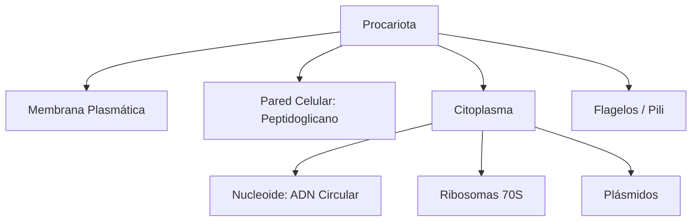

# U05: Biodiversidad - Virus y Procariotas

## 📹 Video de la Lección

**Enlace:** [Biodiversidad - Virus y Procariotas](https://www.youtube.com/watch?v=TI2LhOeX3Ms)

## 📚 Contenido de la Unidad

### Objetivos de Aprendizaje

Al completar esta unidad, deberás ser capaz de:

- ✅ Comparar la estructura de **virus, viroides y priones**.
- ✅ Explicar las etapas del ciclo de **replicación viral**.
- ✅ Describir la estructura de la **célula procariota** y sus orgánulos.
- ✅ Comprender la importancia ecológica de las bacterias (ciclo del nitrógeno).
- ✅ Identificar enfermedades causadas por virus y bacterias y el uso de **antibióticos**.

---

### 1. Virus: Los Agentes Infecciosos No Celulares

Los virus son parásitos intracelulares obligatorios. No tienen metabolismo propio.

- **Estructura:**
  - **Genoma:** ADN o ARN.
  - **Cápside:** Cubierta proteica.
  - **Enuvelta:** (Opcional) Membrana lipídica derivada del huésped.
- **Ciclo de Replicación:** Adsorción -> Penetración -> Desnudamiento -> Biosíntesis -> Ensamblaje -> Liberación.

#### Otras formas acelulares:
- **Viroides:** ARN circular sin proteínas (infectan plantas).
- **Priones:** Proteínas mal plegadas que infectan el cerebro (ej. "vacas locas").

---

### 2. Procariotas: Bacterias y Arqueas

Organismos unicelulares sin núcleo definido.

- **Estructura Celular:**
  - **Pared Celular:** Contiene **peptidoglicano** (mureina) en bacterias.
  - **Nucleoide:** Un solo cromosoma circular de ADN.
  - **Plásmidos:** Pequeños anillos de ADN extra que dan resistencia a antibióticos.
  - **Ribosomas:** Tipo 70S.
- **Reproducción:** Fisión binaria (simple división).
- **Intercambio genético:** Conjugación (vía pili), transformación y transducción.

---

### 3. Importancia Ecológica y Humana

- **Fijación de Nitrógeno:** Bacterias como *Rhizobium* convierten el N2 atmosférico en amoníaco, vital para las plantas.
- **Microbiota:** Bacterias beneficiosas en el intestino humano.
- **Biotecnología:** Producción de insulina, fermentación de alimentos (lácteos).

---

### 4. Salud y Antibióticos

| Agente | Enfermedades | Tratamiento |
|--------|--------------|-------------|
| **Virus** | Gripe, SIDA (VIH), Hepatitis, COVID-19. | Vacunas, Antivirales. |
| **Bacterias** | Tuberculosis, Cólera, Tétanos, Angina. | **Antibióticos**. |

> [!CAUTION]
> **Resistencia Bacteriana:** El uso excesivo de antibióticos selecciona bacterias resistentes, un problema grave de salud global.

---

### 🛠️ Estructura Procariota

### Errores Comunes en el NMT

> [!WARNING]
> - **¡No confundas!** Los antibióticos **NO** matan virus. Solo sirven para bacterias.
> - Los virus pueden tener ADN **o** ARN, pero casi nunca ambos simultáneamente.
> - La pared celular de las arqueas NO tiene peptidoglicano (dferencia clave con bacterias).

## 📝 Resumen

- Los **virus** son la frontera entre lo vivo y lo inerte.
- Las **bacterias** son esenciales para la vida en la Tierra (nitrógeno).
- La **fisión binaria** permite un crecimiento poblacional explosivo.
- El conocimiento de la estructura celular permite diseñar **antibióticos** selectivos.

## 🔗 Recursos Adicionales

- Simulador de crecimiento bacteriano: [PhET](https://phet.colorado.edu/)
- Video de la lección: https://www.youtube.com/watch?v=TI2LhOeX3Ms
- Base de datos de patógenos: [Microbe Wiki](https://microbewiki.kenyon.edu/)

## ✅ Autoevaluación

- [ ] ¿Cuál es la diferencia entre el ciclo lítico y el lisogénico de un virus?
- [ ] ¿Qué orgánulo procariota es responsable de la síntesis de proteínas?
- [ ] Menciona 3 enfermedades bacterianas y 3 virales.
- [ ] ¿Qué es un plásmido y por qué es importante para la medicina?
- [ ] ¿Cómo ayudan las bacterias a las plantas leguminosas?

---

**Última actualización:** Enero 2026
**Fuente:** Programa oficial NMT 2026 - Biología
