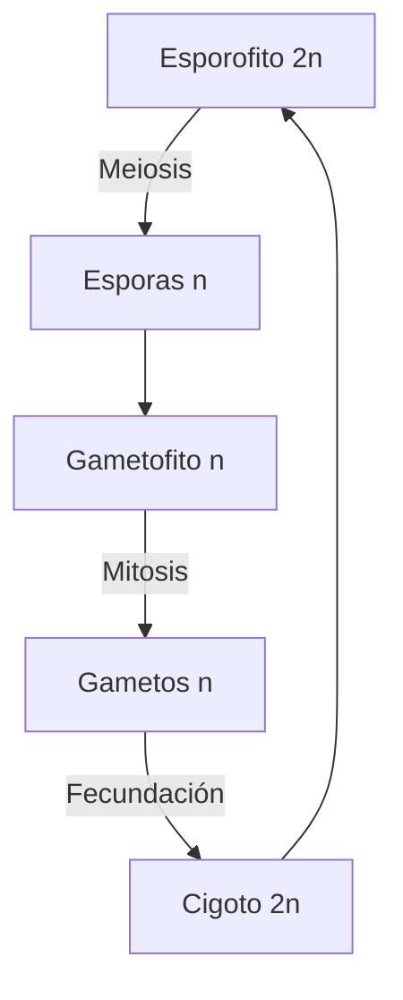

# U06: Biodiversidad - Plantas y Hongos

## 📹 Video de la Lección

**Enlace:** [Biodiversidad - Plantas y Hongos](https://www.youtube.com/watch?v=lhKZNhWo6XA)

## 📚 Contenido de la Unidad

### Objetivos de Aprendizaje

Al completar esta unidad, deberás ser capaz de:

- ✅ Clasificar los principales grupos del **Reino Plantae**.
- ✅ Explicar el proceso de **Doble Fecundación** en angiospermas.
- ✅ Identificar las partes de una flor y sus funciones.
- ✅ Describir las características del **Reino Fungi** y su nutrición heterótrofa.
- ✅ Comprender la simbiosis en los **Líquenes**.

---

### 1. Clasificación del Reino Plantae

| Grupo | Características Clave | Ejemplos |
|-------|-----------------------|----------|
| **Algas** | Acuáticas, sin tejidos verdaderos. | Espirogira, Laminaria. |
| **Briófitas (Musgos)** | Sin vasos conductores (no vasculares), dependen del agua. | Politrico, Esfagno. |
| **Pteridófitas (Helechos)** | Vasculares, con esporas, sin semillas ni flores. | Cola de caballo, Helecho común. |
| **Gimnospermas** | Semillas "desnudas" (en conos), sin flores verdaderas. | Pino, Abeto, Enebro. |
| **Angiospermas** | Plantas con flores y frutos. Semillas protegidas. | Manzano, Trigo, Rosa. |

---

### 2. Estructura de la Flor y Reproducción

La flor es el órgano reproductivo de las angiospermas.

- **Partes Masculinas (Estambre):** Antera (produce polen) y filamento.
- **Partes Femeninas (Pistilo):** Estigma (recibe polen), estilo y ovario (contiene óvulos).

#### Doble Fecundación (Exclusivo de Angiospermas):
1. **Primer espermatozoide + Óvulo** = Cigoto (2n) -> Embrión.
2. **Segundo espermatozoide + Núcleos polares** = Endospermo (3n) -> Tejido nutritivo.

---

### 3. El Reino Fungi (Hongos)

Los hongos no son plantas; son heterótrofos y tienen características propias:

- **Pared Celular:** Hecha de **quitina** (como los insectos, no de celulosa).
- **Cuerpo:** Formado por filamentos llamados **hifas**, que en conjunto forman el **micelio**.
- **Nutrición:** Saprótrofos (materia muerta), parásitos o simbiontes.

---

### 4. Líquenes: Simbiosis Maestra

Un líken no es un organismo individual, sino una asociación:
- **Hongo (Micobionte):** Proporciona estructura, agua y protección.
- **Alga o Cianobacteria (Fotobionte):** Realiza la fotosíntesis y proporciona alimento.

---

### 🛠️ Ciclo de Vida de las Plantas

### Errores Comunes en el NMT

> [!WARNING]
> - **¡No te equivoques!** Los hongos NO hacen fotosíntesis. Son más parecidos a los animales en su nutrición.
> - El **Endospermo** de las angiospermas es triploide (3n), resultado de la doble fecundación.
> - Los musgos son los únicos donde el **Gametofito** es la fase dominante.

## 📝 Resumen

- Las **Angiospermas** son las plantas más evolucionadas gracias a la flor y el fruto.
- La **quitina** es la clave de la pared celular de los hongos.
- Los **líquenes** son bioindicadores de la contaminación del aire.
- El transporte de agua (xilema) y nutrientes (floema) define a las plantas vasculares.

## 🔗 Recursos Adicionales

- Herbario virtual: [Plantas de Ucrania](http://www.botany.kiev.ua)
- Video de la lección: https://www.youtube.com/watch?v=lhKZNhWo6XA
- Guía de Hongos: [Hongos de Europa](https://www.fungipedia.org)

## ✅ Autoevaluación

- [ ] ¿Qué grupo de plantas no tiene vasos conductores? (Musgos).
- [ ] ¿Qué se forma tras la unión del segundo espermatozoide con los núcleos polares?
- [ ] ¿De qué está hecha la pared celular de los hongos?
- [ ] ¿Qué componente del líken realiza la fotosíntesis?
- [ ] Diferencia entre semilla de gimnosperma y angiosperma.

---

**Última actualización:** Enero 2026
**Fuente:** Programa oficial NMT 2026 - Biología
