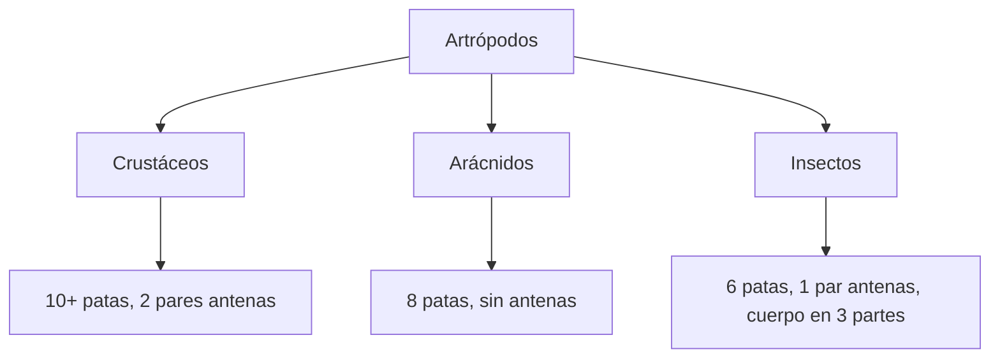

# U07: Biodiversidad - Animales

## 📹 Video de la Lección

**Enlace:** [Biodiversidad - El Reino Animal](https://www.youtube.com/watch?v=J7mI99QvK-A)

## 📚 Contenido de la Unidad

### Objetivos de Aprendizaje

Al completar esta unidad, deberás ser capaz de:

- ✅ Clasificar a los animales en **Invertebrados** y **Vertebrados**.
- ✅ Identificar las características de los principales grupos de animales.
- ✅ Comprender las características de los **Cordados**.
- ✅ Comparar los sistemas vitales (respiratorio, circulatorio, digestivo) entre grupos.
- ✅ Resolver preguntas tipo NMT sobre zoología.

---

### 1. Invertebrados (Casi el 95% de las especies)

| Phylum | Características | Ejemplos |
|--------|-----------------|----------|
| **Poríferos** | Acuáticos, sin tejidos verdaderos, filtradores. | Esponjas. |
| **Cnidarios** | Simetría radial, células urticantes (cnidocitos). | Medusas, Corales. |
| **Platelmintos**| Gusanos planos, muchos son parásitos. | Tenia, Planaria. |
| **Nemátodos** | Gusanos cilíndricos, cuerpo no segmentado. | Ascaris. |
| **Anélidos** | Gusanos segmentados (metamería). | Lombriz de tierra. |
| **Moluscos** | Cuerpo blando, manto, a veces con concha. | Caracol, Pulpo, Almeja. |
| **Artrópodos** | Exoesqueleto de quitina, apéndices articulados. | Insectos, Arañas, Cangrejos. |
| **Equinodermos**| Simetría radial (adultos), sistema acuífero. | Estrella de mar. |

---

### 2. Cordados y Vertebrados

Todos los cordados tienen en alguna etapa: **notocorda**, cordón nervioso dorsal hueco, hendiduras faríngeas y cola post-anal.

#### Clases de Vertebrados:
1. **Peces:** Acuáticos, branquias, escamas, corazón de 2 cavidades (*circulación simple*).
2. **Anfibios:** Doble vida (agua/tierra), respiración cutánea y pulmones simples, corazón de 3 cavidades.
3. **Reptiles:** Piel con escamas queratinizadas (impermeable), huevo amniótico, corazón de 3 cavidades (parcialmente dividido).
4. **Aves:** Plumas, homeotermos (sangre caliente), huesos neumáticos, corazón de 4 cavidades (*separación total*).
5. **Mamíferos:** Glándulas mamarias, pelo, homeotermos, diafragma, corazón de 4 cavidades.

---

### 3. Comparación de Sistemas (Clave NMT)

| Grupo | Respiración | Circulación | Excreción |
|-------|-------------|-------------|-----------|
| **Peces** | Branquias | Cerrada, Simple (1 ciclo) | Riñones |
| **Anfibios**| Branquias (larva) / Pulmones y Piel (adulto) | Cerrada, Doble e Incompleta | Riñones |
| **Reptiles**| Pulmones | Cerrada, Doble e Incompleta | Riñones |
| **Aves** | Pulmones (con sacos aéreos) | Cerrada, Doble y Completa | Riñones |
| **Mamíferos**| Pulmones (alvéolos) | Cerrada, Doble y Completa | Riñones |

---

### 🛠️ Clasificación de Artrópodos (Muy común en NMT)

### Errores Comunes en el NMT

> [!WARNING]
> - **¡Ojo!** Las ballenas y delfines son MAMÍFEROS, no peces. Respiran por pulmones.
> - Los **anfibios** NO tienen circulación completa; la sangre oxigenada y desoxigenada se mezcla en el corazón.
> - Las **arañas** NO son insectos. Pertenecen a la clase arácnidos (tienen 8 patas, no 6).

## 📝 Resumen

- Los **invertebrados** dominan en número, pero los **vertebrados** en complejidad.
- El **huevo amniótico** fue la clave para que los animales conquistaran totalmente la tierra (Reptiles).
- La **homeotermia** (sangre caliente) permite a aves y mamíferos vivir en climas extremos.

## 🔗 Recursos Adicionales

- Bio-enciclopedia de animales: [Animal Diversity Web](https://animaldiversity.org)
- Video: "La evolución de los vertebrados".

## ✅ Autoevaluación

- [ ] ¿Qué grupo tiene huesos neumáticos? (Aves).
- [ ] ¿Cómo se llama el proceso de cambio de exoesqueleto en artrópodos? (Muda/Ecdisis).
- [ ] ¿Qué sistema usan los equinodermos para moverse? (Sistema acuífero).
- [ ] ¿Cuál es la principal diferencia entre circulación completa e incompleta?

---

**Última actualización:** Enero 2026
**Fuente:** Programa oficial NMT 2026 - Biología Animal
