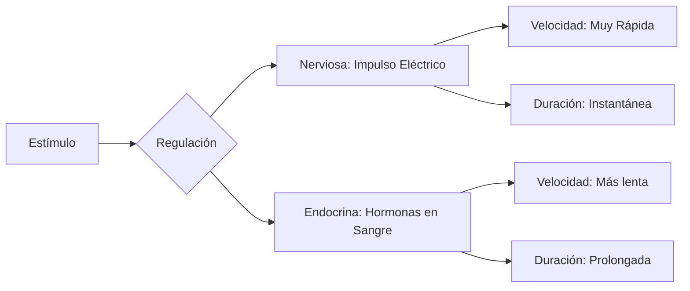

# U08: Biología Humana - Sistemas Reguladores

## 📹 Video de la Lección

**Enlace:** [Sistemas Nervioso y Endocrino en Humanos](https://www.youtube.com/watch?v=Jm11CRb7juk)

## 📚 Contenido de la Unidad

### Objetivos de Aprendizaje

Al completar esta unidad, deberás ser capaz de:

- ✅ Explicar la estructura y función de las **neuronas**.
- ✅ Describir los componentes de un **arco reflejo**.
- ✅ Identificar las principales **glándulas endocrinas** y sus hormonas.
- ✅ Comprender cómo se mantiene la **homeostasis** mediante la regulación neuroendocrina.
- ✅ Diferenciar entre el Sistema Nervioso Central (SNC) y Periférico (SNP).

---

### 1. El Sistema Nervioso: Comunicación Rápida

El sistema nervioso utiliza impulsos eléctricos para transmitir información de forma casi instantánea.

- **La Neurona:** Célula básica. Partes: Cuerpo celular (soma), Dendritas (reciben señal), Axón (envía señal).
- **Arco Reflejo:** La unidad funcional del sistema nervioso para respuestas automáticas.
  1. Receptor -> 2. Neurona Sensorial -> 3. Centro Nervioso (Médula/Cerebro) -> 4. Neurona Motora -> 5. Efector (Músculo).

#### División del Sistema Nervioso:
- **SNC (Central):** Encéfalo y Médula Espinal. Procesa información.
- **SNP (Periférico):** Nervios que conectan el SNC con el resto del cuerpo.
  - *Somático:* Movimientos voluntarios.
  - *Autónomo:* Funciones involuntarias (Simpático/Parasimpático).

---

### 2. El Sistema Endocrino: Control Químico

Utiliza **hormonas** (mensajeros químicos) que viajan por la sangre. Es más lento que el sistema nervioso pero sus efectos son más duraderos.

| Glándula | Hormona Principal | Función |
|----------|-------------------|---------|
| **Hipófisis (Pituitaria)** | GH (Crecimiento), TSH, etc. | "Glándula maestra", controla otras glándulas. |
| **Tiroides** | Tiroxina | Regula el metabolismo energético. |
| **Páncreas** | **Insulina** / Glucagón | Regula los niveles de glucosa en sangre. |
| **Suprarrenales**| Adrenalina / Cortisol | Respuesta al estrés y metabolismo de sales. |
| **Ovarios / Testículos** | Estrógenos / Testosterona | Caracteres sexuales y reproducción. |

---

### 3. Homeostasis y Regulación Neuroendocrina

La **Homeostasis** es el equilibrio interno constante del cuerpo (temperatura, pH, glucosa).
- **El Hipotálamo:** Es el puente. Recibe señales nerviosas y controla la Hipófisis para liberar hormonas. Es el "termostato" del cuerpo.

---

### 🛠️ Comparativa de Sistemas de Regulación

### Errores Comunes en el NMT

> [!WARNING]
> - **¡Truco NMT!** La insulina BAJA el azúcar, el glucagón la SUBE. No los confundas.
> - El **arco reflejo** a menudo NO llega al cerebro consciente (se procesa en la médula) para ganar velocidad.
> - Las **características sexuales secundarias** (barba, voz grave, caderas) son efecto de las hormonas, no del sistema nervioso.

## 📝 Resumen

- El sistema nervioso es como una red de cables eléctricos; el endocrino es como un sistema de correos por la sangre.
- Juntos mantienen la **homeostasis**.
- El **Hipotálamo** es el director de orquesta que coordina ambos sistemas.

## 🔗 Recursos Adicionales

- Atlas de Anatomía: [InnerBody](https://www.innerbody.com/htm/body.html)
- Animación: "El viaje de una hormona".

## ✅ Autoevaluación

- [ ] ¿Cuál es la diferencia entre una dendrita y un axón?
- [ ] ¿Qué hormona produce el páncreas para bajar el azúcar?
- [ ] Menciona los 5 elementos de un arco reflejo.
- [ ] ¿Por qué el hipotálamo es el "puente" entre sistemas?

---

**Última actualización:** Enero 2026
**Fuente:** Programa oficial NMT 2026 - Biología Humana
