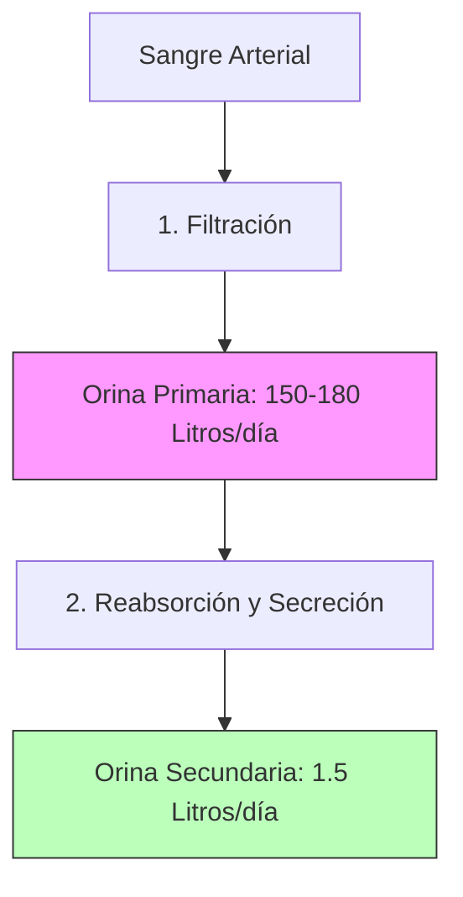

# U09: Biología Humana - Sistemas Viscerales (Parte 1)

## 📹 Video de la Lección

**Enlace:** [Sistemas Digestivo y Excretor](https://www.youtube.com/watch?v=ih7oKazdFPA) *(Enlace de referencia)*

## 📚 Contenido de la Unidad

### Objetivos de Aprendizaje

Al completar esta unidad, deberás ser capaz de:

- ✅ Describir las etapas de la **digestión** (mecánica y química).
- ✅ Identificar los órganos del tubo digestivo y sus funciones.
- ✅ Analizar el papel de las **enzimas** digestivas.
- ✅ Explicar la estructura del **riñón** y la función del **nefrón**.
- ✅ Comprender el proceso de formación de la **orina** (filtración, reabsorción, secreción).

---

### 1. El Sistema Digestivo: Nutrición y Energía

La digestión es el proceso de transformar los alimentos en moléculas pequeñas para ser absorbidas.

#### Órganos y su Función:
- **Boca:** Digestión mecánica y química inicial (amilasa salival para almidones).
- **Estómago:** Digestión de proteínas mediante el jugo gástrico (HCl) y la enzima **Pepsina**. Forma el quimo.
- **Hígado y Páncreas:** Glándulas anejas. El hígado produce bilis (emulsiona grasas); el páncreas secreta enzimas (lipasa, tripsina) y bicarbonato.
- **Intestino Delgado:** Principal sitio de **absorción**. Sus paredes tienen **vellosidades (villi)** que aumentan la superficie de absorción.
- **Intestino Grueso:** Absorción de agua y formación de heces.

---

### 2. Vitaminas y Dieta

Las vitaminas son cofactores esenciales para el metabolismo.
- **Hidrosolubles (B, C):** Se eliminan por orina, deben consumirse a diario.
- **Liposolubles (A, D, E, K):** Se almacenan en el tejido graso. Su exceso puede ser tóxico.

---

### 3. El Sistema Excretor: Filtración de Desechos

Su función principal es eliminar desechos metabólicos (urea, sales) y mantener el equilibrio de agua (**Homeostasis**).

#### El Riñón y el Nefrón:
El nefrón es la unidad funcional del riñón.
1. **Filtración Glomerular:** En el glomérulo se filtra el plasma (agua, glucosa, urea, sales). Las proteínas grandes no pasan.
2. **Reabsorción Tubular:** En el túbulo, el cuerpo recupera lo útil (100% glucosa, la mayoría del agua y sales).
3. **Secreción Tubular:** Se añaden activamente sustancias de desecho (H+, potasio) al túbulo.

---

### 🛠️ Comparativa de Etapas de la Orina

### Errores Comunes en el NMT

> [!WARNING]
> - **¡Truco de examen!** La orina primaria NO contiene proteínas ni células sanguíneas. Si aparecen, hay daño renal.
> - La **glucosa** debe ser reabsorbida al 100%. Su presencia en orina es síntoma de diabetes (glucosuria).
> - La **bilis** NO contiene enzimas; solo separa las grasas en gotas pequeñas para que la lipasa trabaje mejor.

## 📝 Resumen

- El sistema digestivo descompone (enzimas) y absorbe (vellosidades).
- Los riñones limpian la sangre mediante el **nefrón**.
- La reabsorción es vital: pasamos de 180 litros de orina primaria a solo 1.5 litros de orina final al día.

## 🔗 Recursos Adicionales

- Simulador de digestión: [Visible Body](https://www.visiblebody.com)
- Video: "El viaje del Nefrón".

## ✅ Autoevaluación

- [ ] ¿En qué órgano se absorbe la mayoría de los nutrientes? (Intestino delgado).
- [ ] ¿Qué diferencia hay entre orina primaria y secundaria?
- [ ] Menciona una vitamina liposoluble.
- [ ] ¿Cuál es la función de la Pepsina? (Digerir proteínas en el estómago).

---

**Última actualización:** Enero 2026
**Fuente:** Programa oficial NMT 2026 - Biología Humana
